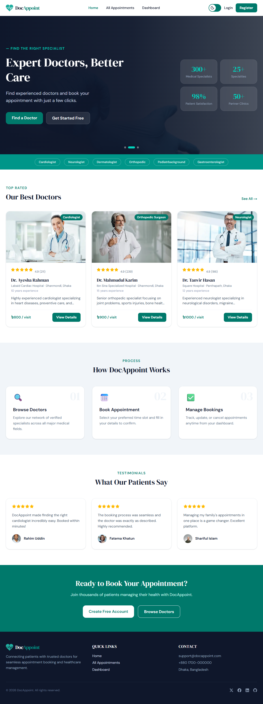
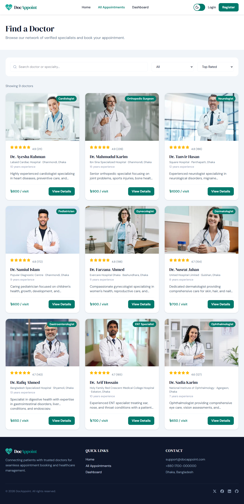
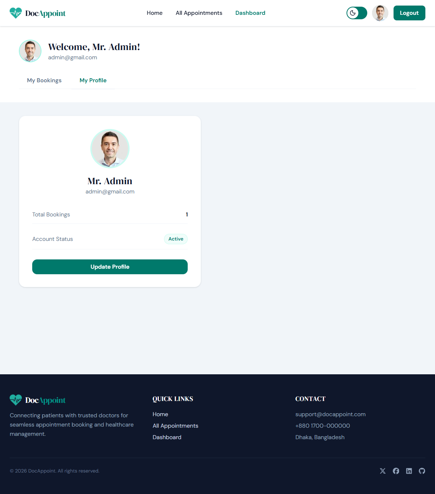

# 🩺 DocAppoint

**DocAppoint** is a modern doctor appointment booking web application that makes it easy for patients to discover doctors, view doctor details, book appointments, and manage their profiles and appointments from a single platform.

The project is built with **Next.js, React, Tailwind CSS, Better Auth, MongoDB, and Express.js**, with a focus on a clean, responsive, and user-friendly experience.

---
### Live link: ****https://doc-appoint-client-chi.vercel.app****

### 🧪 Demo Login Credentials

You can use the following demo account to test the application:
* Email: admin@gmail.com
* Password: Admin123
---

## ✨ Features

### 👤 Authentication

* User registration and login
* Email/password authentication
* Secure session management with Better Auth
* Protected pages and authenticated API requests
* User profile management

### 👨‍⚕️ Doctor Management

* Browse available doctors
* View doctor profiles and details
* View specialization and professional information
* Check doctor availability
* Book appointments with doctors

### 📅 Appointment Management

* Book doctor appointments
* View appointment details
* View all personal appointments
* Appointment status management
* Prevent invalid/unavailable bookings

### 👤 User Profile

* View account information
* Update profile information
* Profile image support
* Display user-specific appointment history

### 🎨 UI & UX

* Fully responsive design
* Modern healthcare-focused interface
* Light/Dark theme support
* Loading states
* Toast notifications
* Mobile-friendly navigation
* Clean and accessible components

---

## 🛠️ Technologies Used

### Frontend

* **Next.js**
* **React**
* **Tailwind CSS**
* **HeroUI**
* **Lucide React**
* **React Icons**
* **React Toastify**
* **Next/Image**

### Backend

* **Node.js**
* **Express.js**
* **MongoDB**
* **MongoDB Node.js Driver**
* **Better Auth**
* **JWT / JWKS verification**

### Deployment

* **Vercel** — Frontend
* **MongoDB Atlas** — Database
* **Express.js Backend** — Deployed backend API

---

## 🏗️ Project Architecture

```text
DocAppoint
│
├── Client
│   ├── Next.js
│   ├── React
│   ├── Tailwind CSS
│   ├── HeroUI
│   └── Better Auth
│
├── Server
│   ├── Node.js
│   ├── Express.js
│   ├── MongoDB
│   └── JWT/JWKS Authorization
│
└── Database
    └── MongoDB Atlas
```

---

## 📂 Main Project Structure

```text
docAppoint/
│
├── client/
│   ├── app/
│   ├── components/
│   ├── lib/
│   ├── public/
│   ├── providers/
│   ├── package.json
│   └── ...
│
├── server/
│   ├── index.js
│   ├── package.json
│   ├── .env
│   └── ...
│
└── README.md
```
---

## 🚀 Getting Started

Follow these steps to run DocAppoint locally.

### 1. Clone the Repository

```bash
git clone https://github.com/your-username/docAppoint.git
```

Navigate into the project:

```bash
cd docAppoint
```

---

# 💻 Client Setup

Go to the client directory:

```bash
cd client
```

Install dependencies:

```bash
npm install
```

Create a `.env.local` file:

```env
BETTER_AUTH_SECRET=your_better_auth_secret
BETTER_AUTH_URL=http://localhost:3000

MONGO_URI=your_mongodb_connection_string

GOOGLE_CLIENT_ID=your_google_client_id
GOOGLE_CLIENT_SECRET=your_google_client_secret

NEXT_PUBLIC_API_URL=http://localhost:5000
```

Start the development server:

```bash
npm run dev
```

The client will run at:

```text
http://localhost:3000
```

---

# ⚙️ Server Setup

Open another terminal and navigate to the server:

```bash
cd server
```

Install dependencies:

```bash
npm install
```

Create a `.env` file:

```env
MONGODB_URI=your_mongodb_connection_string
BETTER_AUTH_SECRET=your_better_auth_secret
CLIENT_URL=http://localhost:3000
PORT=5000
```

Start the server:

```bash
npm start
```

For development with Nodemon:

```bash
nodemon index.js
```

The API will run at:

```text
http://localhost:5000
```

---

## 🔐 Environment Variables

Never commit your `.env` or `.env.local` files to GitHub.

Make sure your `.gitignore` contains:

```gitignore
node_modules
.env
.env.local
.next
.vercel
```

You should create your own environment variables based on the required configuration.

---

## 🔑 Authentication Flow

DocAppoint uses **Better Auth** for authentication and session management.

The general authentication flow is:

```text
User
  │
  ▼
Login / Register
  │
  ▼
Better Auth
  │
  ▼
Session Created
  │
  ▼
Authenticated User
  │
  ├── Profile
  ├── Appointments
  └── Doctor Booking
```

Protected requests use the authenticated user's session/token to ensure that users can access their own data securely.

---

## 📡 API Overview

The Express backend provides APIs for application data and appointment management.

### Doctor APIs

```text
GET    /appointments
GET    /appointments/:id
```

### Booking APIs

```text
POST   /booking
GET    /booking/:userId
DELETE /booking/:bookingId
PATCH  /booking/:bookingId
```

### Profile APIs

```text
GET    /user/:userId
PATCH  /user/:userId
```

> API routes may differ slightly depending on the current backend implementation.

---

## 📱 Responsive Design

DocAppoint is designed to work across different screen sizes:

* 📱 Mobile
* 📲 Tablet
* 💻 Desktop
* 🖥️ Large screens

The interface uses responsive Tailwind CSS utilities to provide a consistent experience across devices.

---

## 🌙 Theme Support

DocAppoint supports both:

* ☀️ Light Mode
* 🌙 Dark Mode

Users can switch between themes using the theme toggle available in the application.

---

## 🔒 Security

Some of the security considerations implemented in the project include:

* Authentication using Better Auth
* Protected user-specific data
* Server-side session validation
* Authorized API requests
* Environment variables for sensitive credentials
* MongoDB database security
* JWT/JWKS-based authorization where required

---

## 🚀 Deployment

### Frontend

The Next.js application can be deployed using **Vercel**.

Before deploying, configure the required environment variables in the Vercel project settings.

### Backend

The Express.js server can be deployed using services such as:

* Render
* Railway
* Vercel Functions
* Other Node.js hosting platforms

After deployment, update the frontend API URL:

```env
NEXT_PUBLIC_API_URL=https://your-backend-url.com
```

---

## 📸 Screenshots

Add screenshots of your application here after uploading them to the repository.

Example:

```md
## 📸 Screenshots

### Home Page



### Doctor Details



### My Bookings


### My Profile



```
